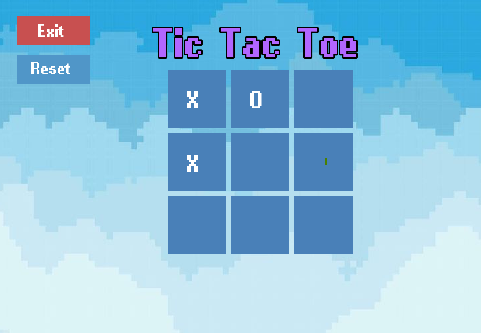
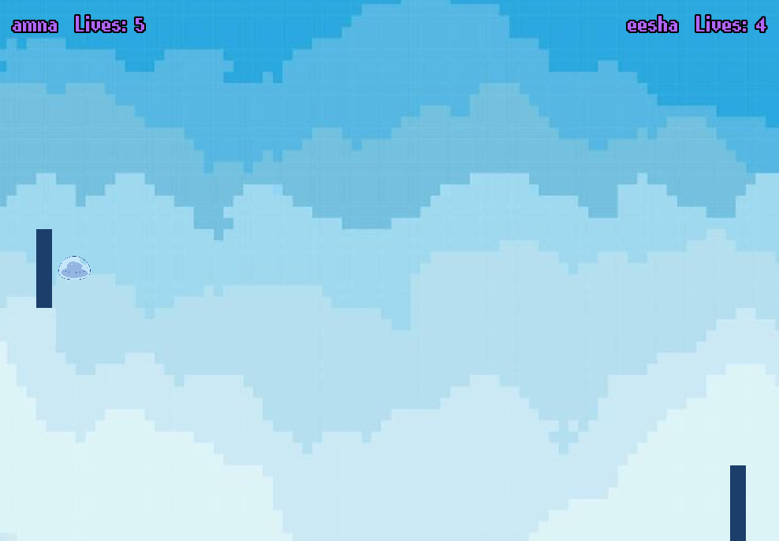
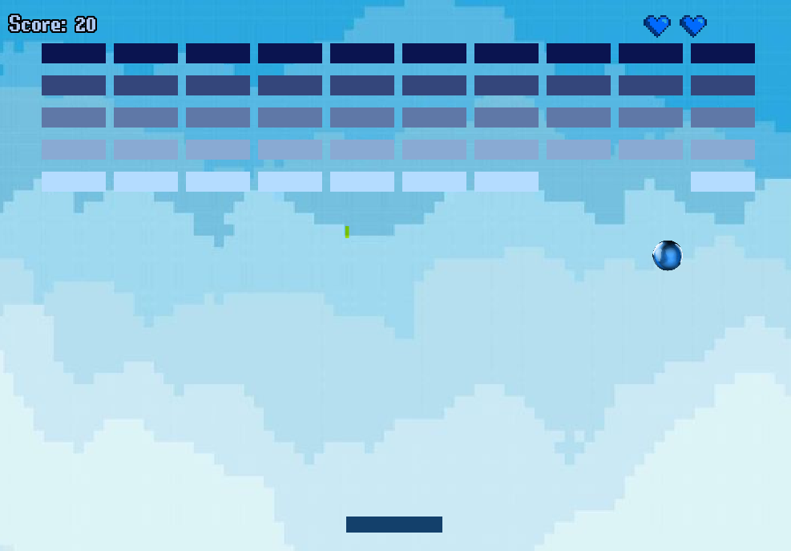
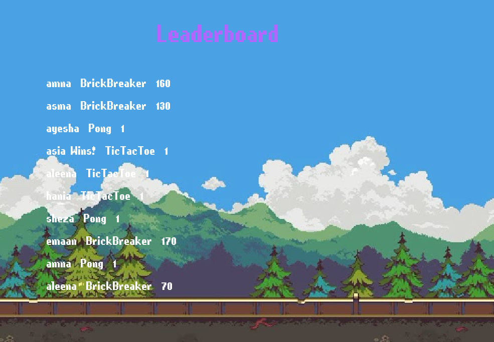

# Gaming-Hub-OOP
A multi-game arcade built in C++ with SFML ; Tic Tac Toe, Pong, and Brick Breaker with a shared leaderboard

# Games Included
- Tic Tac Toe
- Ping Pong
- Brick Breaker

# Features
- Central Hub: A main menu screen for navigating between all available games and the leaderboard
- Tic Tac Toe: Classic two-player game with win, loss, and draw detection
- Ping Pong: Two-player paddle game with score tracking
- Brick Breaker: Single-player arcade game with score-based progression
- Leaderboard: Persistent score tracking across all three games, saved to a local file and displayed with scroll support
- Sound Effects & Background Music: Audio feedback for button clicks, in-game actions, and game-over events
- Custom Player Names: Name entry screens before each game session

# Screenshots

  
  
  

  
  

# Built With
- C++ 
- SFML for Graphics, audio, and window/event handling
- Visual Studio
